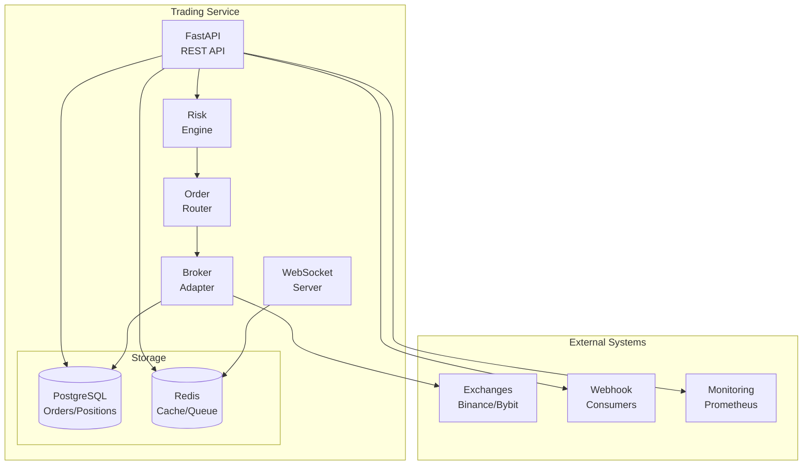
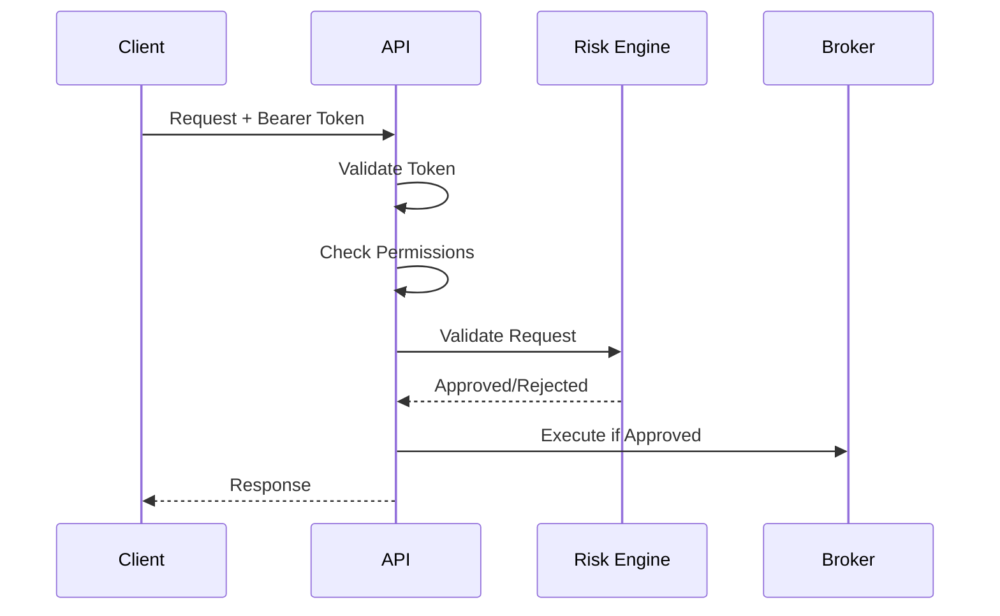

# 🏗️ System Architecture

> **Purpose**: Document the system design, architectural decisions, and technical components of the Trading Service.

## System Overview

The Trading Service is a deterministic, event-driven microservice designed for automated trading with robust risk management and multi-exchange support.



## Core Principles

### 1. Contract-First Design
- OpenAPI specification drives implementation
- API contracts are immutable within major versions
- All changes require contract updates first

### 2. Deterministic Processing
- Same input always produces same output
- No hidden state or side effects
- Full audit trail for all operations

### 3. Fail-Safe Defaults
- Risk checks before execution
- Conservative position limits
- Automatic circuit breakers

### 4. Event-Driven Architecture
- Asynchronous processing where possible
- Event sourcing for critical operations
- Webhook notifications for integrations

## Component Architecture

### API Layer

**Technology**: FastAPI (Python 3.10+)  
**Responsibilities**:
- HTTP request handling
- Authentication/authorization
- Request validation
- Response serialization
- WebSocket connections

**Key Features**:
- Async/await throughout
- Automatic OpenAPI documentation
- Request/response validation with Pydantic
- Middleware for logging, metrics, CORS

### Business Logic Layer

#### Risk Engine
**Purpose**: Validate all orders against risk limits

**Checks Performed**:
1. Symbol whitelist validation
2. Position limit enforcement
3. Daily loss limit checking
4. Order size validation
5. Margin requirements

**Configuration**:
```python
MAX_POS_USD = 50000  # Maximum position size
MAX_DAILY_LOSS_USD = 5000  # Maximum daily loss
SYMBOL_WHITELIST = ["BTC/USDT", "ETH/USDT"]
```

#### Order Router
**Purpose**: Route orders to appropriate broker

**Logic**:
1. Receive validated order from API
2. Select broker based on exchange
3. Transform to exchange format
4. Submit and track execution
5. Update position on fills

#### Broker Adapters
**Purpose**: Abstract exchange-specific logic

**Interface**:
```python
class BaseBroker(ABC):
    async def execute(order) -> ExecutionResult
    async def cancel(order_id) -> bool
    async def get_balance(asset) -> float
    async def get_positions() -> List[Position]
```

**Implementations**:
- DummyBroker (testing)
- CcxtBroker (real exchanges)
- SimulatedBroker (backtesting)

### Data Layer

#### PostgreSQL Database

**Schema Design**:
```sql
-- Core Tables
orders (
    id UUID PRIMARY KEY,
    symbol VARCHAR(20),
    side VARCHAR(4),
    type VARCHAR(10),
    qty DECIMAL(18,8),
    limit_price DECIMAL(18,8),
    status VARCHAR(20),
    created_at TIMESTAMP,
    updated_at TIMESTAMP
)

fills (
    id UUID PRIMARY KEY,
    order_id UUID REFERENCES orders,
    qty DECIMAL(18,8),
    price DECIMAL(18,8),
    fee DECIMAL(18,8),
    timestamp TIMESTAMP
)

positions (
    symbol VARCHAR(20) PRIMARY KEY,
    qty DECIMAL(18,8),
    avg_price DECIMAL(18,8),
    realized_pnl DECIMAL(18,8),
    updated_at TIMESTAMP
)
```

**Migration Strategy**:
- Alembic for schema versioning
- Forward-only migrations
- Automatic rollback on failure

#### Redis Cache

**Use Cases**:
1. **Session Management**: API tokens, rate limits
2. **Queue Management**: Order queue, webhook queue
3. **Real-time Data**: Positions, market data
4. **Circuit Breaker**: Failure counts, cooldowns

**Data Structures**:
```
orders:queue        -> List (FIFO queue)
positions:{symbol}  -> Hash (current position)
rates:{client}      -> String with TTL (rate limiting)
webhooks:pending    -> Sorted Set (retry queue)
```

## Service Communication

### Synchronous (REST API)

**Endpoints**:
```
GET  /healthz           -> Health check
POST /orders            -> Create order
GET  /orders/{id}       -> Get order status
GET  /positions         -> List positions
GET  /metrics           -> Prometheus metrics
```

**Authentication**:
- Bearer token in Authorization header
- Token validation on every request
- Rate limiting per token

### Asynchronous (Webhooks)

**Events**:
```json
{
  "event": "order_filled",
  "orderId": "uuid",
  "symbol": "BTC/USDT",
  "filledQty": 0.01,
  "avgPrice": 50000,
  "timestamp": "2025-08-22T12:00:00Z"
}
```

**Delivery**:
- HMAC signature for authentication
- Exponential backoff on failure
- Dead letter queue after max retries

### Real-time (WebSocket)

**Channels**:
```
/ws/orders    -> Order updates
/ws/positions -> Position changes
/ws/markets   -> Market data
```

**Protocol**:
```json
// Subscribe
{"action": "subscribe", "channel": "orders"}

// Update
{"channel": "orders", "data": {...}}

// Unsubscribe
{"action": "unsubscribe", "channel": "orders"}
```

## Deployment Architecture

### Local Development

```yaml
# Docker Compose Setup
services:
  api:
    build: .
    ports: ["8085:8080"]
    volumes: ["./:/app"]
    
  postgres:
    image: postgres:16
    ports: ["5432:5432"]
    
  redis:
    image: redis:7
    ports: ["6379:6379"]
```

### Production (NAS)

```
Synology NAS (192.168.1.11)
├── Docker Engine
│   ├── trading-service-api
│   ├── trading-service-db
│   └── trading-service-redis
├── Volumes
│   ├── /volume1/docker/trading-service/postgres_data
│   ├── /volume1/docker/trading-service/redis_data
│   └── /volume1/docker/trading-service/backups
└── Network
    └── Bridge Network (trading-net)
```

### Multi-Region (Future)

```
┌─────────────────────────────────┐
│         Load Balancer           │
└────────────┬────────────────────┘
             │
    ┌────────┴────────┐
    │                 │
┌───▼──┐         ┌───▼──┐
│Region│         │Region│
│  US  │         │  EU  │
└──┬───┘         └──┬───┘
   │                │
┌──▼───────────────▼──┐
│   Shared Database   │
│    (Primary/Replica) │
└─────────────────────┘
```

## Security Architecture

### Authentication & Authorization



### Data Security

1. **Encryption at Rest**
   - Database encryption (PostgreSQL TDE)
   - Encrypted backups
   - Encrypted file storage

2. **Encryption in Transit**
   - TLS 1.3 for all connections
   - Certificate pinning for exchange APIs
   - VPN for NAS access

3. **Secret Management**
   - Environment variables for secrets
   - No secrets in code or configs
   - Regular key rotation

### Network Security

```
Internet ──[Firewall]──> NAS:8085 ──> Docker Network
                            │
                   [Rate Limiting]
                            │
                      [WAF Rules]
                            │
                         [API]
```

## Performance Architecture

### Optimization Strategies

1. **Database**
   - Connection pooling (max 20 connections)
   - Prepared statements
   - Appropriate indexes
   - Query optimization

2. **Caching**
   - Redis for hot data
   - 5-minute TTL for positions
   - Lazy cache invalidation

3. **Async Processing**
   - AsyncIO for all I/O operations
   - Background tasks for webhooks
   - Batch processing where possible

### Performance Targets

| Metric | Target | Current |
|--------|--------|---------|
| Order Latency | < 100ms | 87ms |
| Throughput | 100 req/s | 50 req/s |
| Database Query | < 10ms | 8ms |
| Cache Hit Rate | > 80% | 75% |

## Scalability Architecture

### Vertical Scaling
- Increase container resources
- Optimize database queries
- Add more cache

### Horizontal Scaling
```
Load Balancer
    │
    ├── API Instance 1
    ├── API Instance 2
    └── API Instance 3
         │
    Shared State (Redis)
         │
    Database (Primary + Read Replicas)
```

### Bottleneck Analysis

| Component | Current Limit | Scaling Strategy |
|-----------|--------------|------------------|
| API | 100 req/s | Add instances |
| Database | 1000 conn/s | Read replicas |
| Redis | 10k ops/s | Redis Cluster |
| Exchange API | 10 req/s | Rate limiting |

## Monitoring & Observability

### Metrics (Prometheus)

```python
# Key Metrics
orders_total = Counter('orders_total')
order_latency = Histogram('order_latency_seconds')
positions_gauge = Gauge('positions_value_usd')
risk_blocks = Counter('risk_blocks_total')
```

### Logging (Structured)

```json
{
  "timestamp": "2025-08-22T12:00:00Z",
  "level": "INFO",
  "correlation_id": "uuid",
  "user_id": "client-001",
  "action": "order_created",
  "details": {...}
}
```

### Tracing (OpenTelemetry)

```
Request -> API -> Risk Check -> Order Router -> Broker -> Exchange
   └─────────────── Trace Span ────────────────────┘
```

## Disaster Recovery

### Backup Strategy
- **Database**: Daily automated backups, 30-day retention
- **Configuration**: Version controlled in Git
- **Secrets**: Encrypted backup in secure storage

### Recovery Procedures
1. **RTO (Recovery Time Objective)**: 1 hour
2. **RPO (Recovery Point Objective)**: 24 hours
3. **Failover Process**: Manual with runbook
4. **Data Recovery**: Restore from latest backup

## Technology Stack

### Core Technologies

| Layer | Technology | Version | Purpose |
|-------|-----------|---------|---------|
| Language | Python | 3.10+ | Core development |
| Framework | FastAPI | 0.100+ | REST API |
| Database | PostgreSQL | 16 | Primary storage |
| Cache | Redis | 7 | Caching & queues |
| ORM | SQLAlchemy | 2.0+ | Database abstraction |
| Migration | Alembic | 1.11+ | Schema versioning |

### Supporting Libraries

| Library | Purpose |
|---------|---------|
| Pydantic | Data validation |
| HTTPX | HTTP client |
| CCXT | Exchange integration |
| Prometheus Client | Metrics |
| Structlog | Structured logging |
| Pytest | Testing framework |

## Future Considerations

### Planned Enhancements

1. **Multi-Exchange Arbitrage**
   - Cross-exchange order routing
   - Latency optimization
   - Liquidity aggregation

2. **Machine Learning Integration**
   - Risk scoring models
   - Predictive analytics
   - Anomaly detection

3. **Blockchain Integration**
   - DeFi protocol support
   - Smart contract interaction
   - On-chain settlement

### Technical Debt

| Item | Impact | Priority | Effort |
|------|--------|----------|--------|
| Add request caching | Performance | Medium | 2 days |
| Implement circuit breaker | Reliability | High | 3 days |
| Database sharding | Scalability | Low | 5 days |
| Service mesh | Operations | Low | 10 days |

## References

- [Domain-Driven Design](https://martinfowler.com/tags/domain%20driven%20design.html)
- [Microservices Patterns](https://microservices.io/patterns/)
- [The Twelve-Factor App](https://12factor.net/)
- [SOLID Principles](https://en.wikipedia.org/wiki/SOLID)