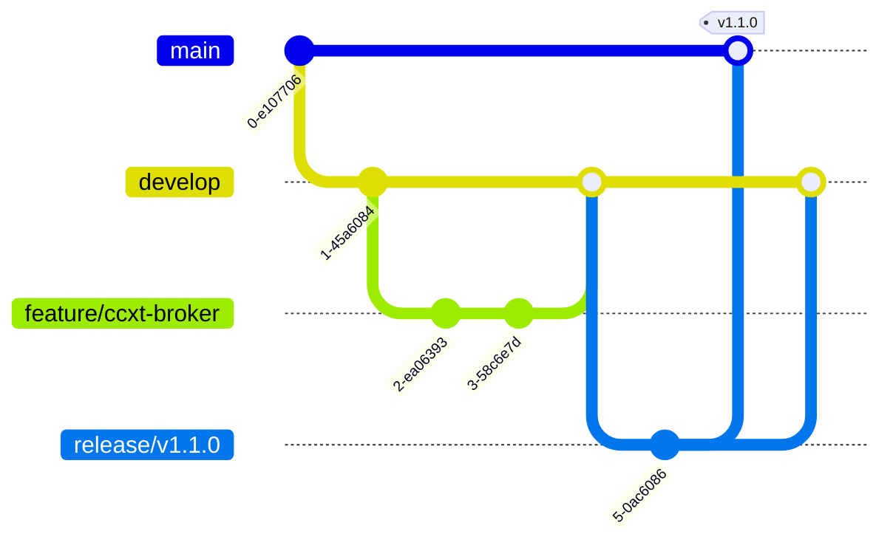

# 🔄 Development Workflow

> **Purpose**: Define the standard development workflow, branching strategy, and quality gates for the Trading Service project.

## Table of Contents
- [Git Workflow](#git-workflow)
- [Branch Strategy](#branch-strategy)
- [Development Process](#development-process)
- [Code Review](#code-review)
- [Testing Requirements](#testing-requirements)
- [Release Process](#release-process)
- [Hotfix Procedure](#hotfix-procedure)

## Git Workflow

We follow a modified Git Flow strategy optimized for continuous deployment:



## Branch Strategy

### Branch Types

| Branch Type | Naming Convention | Created From | Merges To | Purpose |
|------------|------------------|--------------|-----------|---------|
| `main` | `main` | - | - | Production-ready code |
| `develop` | `develop` | `main` | `main` | Integration branch |
| Feature | `feature/description` | `develop` | `develop` | New features |
| Fix | `fix/description` | `develop` | `develop` | Bug fixes |
| Hotfix | `hotfix/description` | `main` | `main` + `develop` | Emergency fixes |
| Release | `release/vX.Y.Z` | `develop` | `main` + `develop` | Release preparation |

### Branch Protection Rules

#### Main Branch
- ✅ Require pull request reviews (minimum 1)
- ✅ Require status checks to pass
- ✅ Require branches to be up to date
- ✅ Include administrators
- ✅ Restrict force pushes
- ✅ Require signed commits

#### Develop Branch
- ✅ Require pull request reviews
- ✅ Require status checks to pass
- ✅ Dismiss stale reviews

## Development Process

### 1. Starting New Work

```bash
# Update your local repository
git checkout develop
git pull origin develop

# Create feature branch
git checkout -b feature/webhook-implementation

# Make your changes
# ... code ...

# Commit with conventional commits
git commit -m "feat: implement webhook HMAC signatures"
```

### 2. Conventional Commits

We use [Conventional Commits](https://www.conventionalcommits.org/) for clear history:

- `feat:` New feature
- `fix:` Bug fix
- `docs:` Documentation changes
- `style:` Code style changes (formatting)
- `refactor:` Code refactoring
- `perf:` Performance improvements
- `test:` Test additions or fixes
- `chore:` Build process or auxiliary tool changes

Examples:
```bash
git commit -m "feat: add CCXT broker implementation for Binance"
git commit -m "fix: correct position calculation in risk engine"
git commit -m "docs: update API documentation for order endpoints"
```

### 3. Work In Progress

```bash
# Save work without committing
git stash

# Or create WIP commit (will be squashed)
git commit -m "WIP: partial implementation"

# Continue later
git stash pop
```

## Code Review

### Pull Request Process

1. **Create PR from feature branch to develop**
2. **Fill out PR template completely**
3. **Ensure all checks pass**
4. **Request review from team member**
5. **Address feedback**
6. **Squash and merge when approved**

### PR Checklist

```markdown
## Description
Brief description of changes

## Type of Change
- [ ] Bug fix (non-breaking change)
- [ ] New feature (non-breaking change)
- [ ] Breaking change
- [ ] Documentation update

## Testing
- [ ] Unit tests pass
- [ ] Integration tests pass
- [ ] Manual testing completed

## Checklist
- [ ] Code follows style guidelines
- [ ] Self-review completed
- [ ] Comments added for complex code
- [ ] Documentation updated
- [ ] No new warnings
- [ ] Tests added/updated
- [ ] All tests passing
- [ ] API contract maintained
```

### Review Guidelines

#### For Reviewers
- Check business logic correctness
- Verify test coverage
- Ensure code style consistency
- Look for security issues
- Validate performance impact
- Confirm documentation updates

#### For Authors
- Keep PRs small and focused
- Respond to feedback promptly
- Update PR description as needed
- Rebase if needed
- Clean commit history

## Testing Requirements

### Coverage Requirements

| Component | Minimum Coverage |
|-----------|-----------------|
| Business Logic | 90% |
| API Endpoints | 85% |
| Risk Engine | 95% |
| Brokers | 80% |
| Overall | 85% |

### Test Execution

```bash
# Run all tests
make test

# Run with coverage
pytest --cov=apps --cov=pkg --cov-report=html

# Run specific test file
pytest tests/unit/test_risk_engine.py

# Run integration tests only
pytest tests/integration/
```

### Pre-Push Checklist

- [ ] All tests pass locally
- [ ] Code formatted with `black`
- [ ] Linting passes with `ruff`
- [ ] Type checking passes with `mypy`
- [ ] No sensitive data in commits

## Release Process

### 1. Create Release Branch

```bash
git checkout develop
git pull origin develop
git checkout -b release/v1.2.0
```

### 2. Prepare Release

- Update version in `pyproject.toml`
- Update `CHANGELOG.md`
- Update documentation
- Run full test suite
- Deploy to staging

### 3. Finalize Release

```bash
# Merge to main
git checkout main
git merge --no-ff release/v1.2.0
git tag -a v1.2.0 -m "Release version 1.2.0"
git push origin main --tags

# Back-merge to develop
git checkout develop
git merge --no-ff release/v1.2.0
git push origin develop

# Delete release branch
git branch -d release/v1.2.0
```

### 4. Deploy to Production

```bash
# Deploy tagged version
make nas-deploy
```

## Hotfix Procedure

For critical production issues:

### 1. Create Hotfix Branch

```bash
git checkout main
git checkout -b hotfix/critical-fix
```

### 2. Implement Fix

- Make minimal changes
- Add regression test
- Update patch version

### 3. Deploy Hotfix

```bash
# Merge to main
git checkout main
git merge --no-ff hotfix/critical-fix
git tag -a v1.2.1 -m "Hotfix: critical issue"
git push origin main --tags

# Merge to develop
git checkout develop
git merge --no-ff hotfix/critical-fix
git push origin develop

# Deploy immediately
make nas-deploy
```

## Commit Hooks

### Pre-commit Configuration

```yaml
# .pre-commit-config.yaml
repos:
  - repo: https://github.com/pre-commit/pre-commit-hooks
    hooks:
      - id: trailing-whitespace
      - id: end-of-file-fixer
      - id: check-yaml
      - id: check-added-large-files
  
  - repo: https://github.com/psf/black
    hooks:
      - id: black
  
  - repo: https://github.com/charliermarsh/ruff-pre-commit
    hooks:
      - id: ruff
```

### Installation

```bash
pip install pre-commit
pre-commit install
```

## Best Practices

### Do's ✅
- Write descriptive commit messages
- Keep commits atomic and focused
- Update documentation with code changes
- Write tests before fixing bugs
- Use feature flags for gradual rollouts
- Review your own PR before requesting review

### Don'ts ❌
- Don't commit directly to main or develop
- Don't merge without review
- Don't skip tests
- Don't commit sensitive data
- Don't force push to shared branches
- Don't merge with failing CI

## Tools & Scripts

### Useful Commands

```bash
# Check branch status
make branch-status

# Run pre-commit manually
pre-commit run --all-files

# Clean up merged branches
git branch --merged | grep -v main | xargs -n 1 git branch -d

# Interactive rebase
git rebase -i HEAD~3

# Amend last commit
git commit --amend

# Cherry-pick commit
git cherry-pick <commit-hash>
```

## Troubleshooting

### Common Issues

#### Merge Conflicts
```bash
# Update branch with latest develop
git checkout feature/my-feature
git rebase develop
# Resolve conflicts
git add .
git rebase --continue
```

#### Accidental Commit to Wrong Branch
```bash
# Move commit to correct branch
git checkout correct-branch
git cherry-pick <commit-hash>
git checkout wrong-branch
git reset --hard HEAD~1
```

#### Need to Undo Last Commit
```bash
# Keep changes
git reset --soft HEAD~1

# Discard changes
git reset --hard HEAD~1
```

## References

- [Git Flow](https://nvie.com/posts/a-successful-git-branching-model/)
- [Conventional Commits](https://www.conventionalcommits.org/)
- [Semantic Versioning](https://semver.org/)
- [GitHub Flow](https://guides.github.com/introduction/flow/)