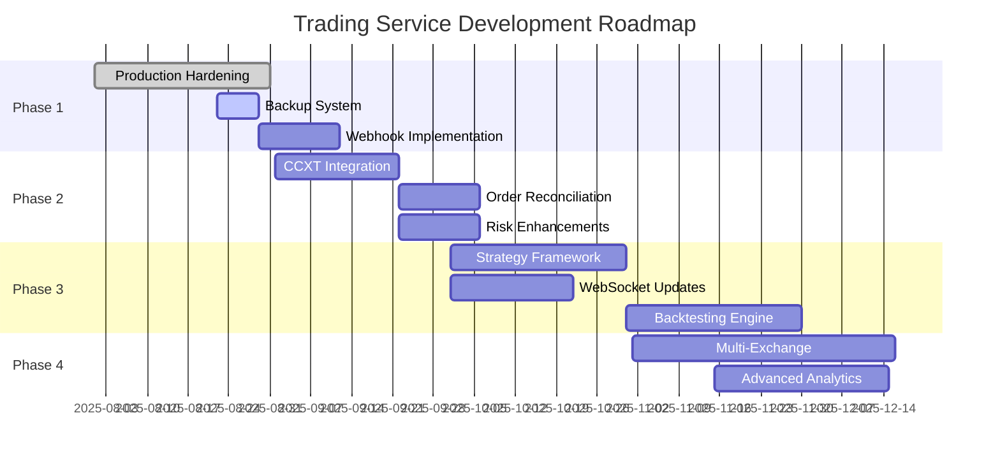

# 🗺️ Trading Service Roadmap

> **Purpose**: Track feature development, prioritize work, and communicate project direction.

## Vision

Build a robust, production-ready automated trading service that:
- Executes trades reliably across multiple exchanges
- Manages risk with configurable limits and safeguards
- Provides real-time monitoring and alerting
- Supports custom trading strategies
- Maintains audit trails and compliance

## Roadmap Overview

## Development Phases

### ✅ Phase 0: MVP Foundation (Completed)
**Timeline**: August 1-21, 2025  
**Status**: ✅ Complete

- [x] Core API structure with FastAPI
- [x] PostgreSQL + Redis integration
- [x] Basic risk engine with position limits
- [x] Dummy broker for testing
- [x] Docker deployment to NAS
- [x] Health monitoring endpoints
- [x] Prometheus metrics
- [x] GitHub repository setup

### 🚧 Phase 1: Production Hardening
**Timeline**: August 22 - September 15, 2025  
**Status**: 🟡 In Progress (75%)

#### 1.1 Infrastructure Reliability
- [x] Deployment automation scripts
- [x] Health check system
- [ ] Automated backup system
  - [ ] Fix backup.sh script paths
  - [ ] Set up Synology Task Scheduler
  - [ ] Test restore procedure
  - [ ] Document recovery process
- [ ] Log aggregation and rotation
- [ ] Alert system setup

#### 1.2 Webhook System
- [ ] Implement webhook dispatcher
- [ ] Add HMAC signature validation
- [ ] Create retry mechanism with exponential backoff
- [ ] Add webhook event queue in Redis
- [ ] Create webhook management API
- [ ] Add webhook testing endpoints

#### 1.3 Error Handling & Recovery
- [ ] Structured logging with correlation IDs
- [ ] Circuit breaker for external services
- [ ] Graceful shutdown handling
- [ ] State recovery on restart
- [ ] Dead letter queue for failed operations

### 📅 Phase 2: Real Exchange Integration
**Timeline**: September 16 - October 31, 2025  
**Status**: 🔵 Planned

#### 2.1 CCXT Broker Implementation
- [ ] Create CcxtBroker class
- [ ] Binance Testnet integration
- [ ] Bybit Testnet integration
- [ ] Order placement and cancellation
- [ ] Balance and position queries
- [ ] Market data integration
- [ ] Rate limiting implementation
- [ ] Exchange error handling

#### 2.2 Order Management System
- [ ] Order state machine
- [ ] Partial fill handling
- [ ] Order timeout management
- [ ] Order amendment support
- [ ] Fill reconciliation
- [ ] Order history API
- [ ] Performance analytics

#### 2.3 Advanced Risk Management
- [ ] Per-symbol position limits
- [ ] Portfolio-level risk metrics
- [ ] Kill switch implementation
- [ ] Drawdown protection
- [ ] Correlation risk analysis
- [ ] Dynamic position sizing
- [ ] Risk dashboard

### 📅 Phase 3: Advanced Features
**Timeline**: November 1 - December 31, 2025  
**Status**: 🔵 Planned

#### 3.1 Strategy Framework
- [ ] BaseStrategy abstract class
- [ ] Strategy lifecycle management
- [ ] Parameter optimization
- [ ] Strategy backtesting
- [ ] Paper trading mode
- [ ] Strategy performance metrics
- [ ] Strategy marketplace

#### 3.2 Real-time Communication
- [ ] WebSocket server implementation
- [ ] Order status updates
- [ ] Position updates
- [ ] Market data streaming
- [ ] Price alerts
- [ ] Client libraries (Python, JS)
- [ ] WebSocket authentication

#### 3.3 Backtesting Engine
- [ ] Historical data management
- [ ] Backtesting framework
- [ ] Performance metrics calculation
- [ ] Slippage simulation
- [ ] Fee calculation
- [ ] Report generation
- [ ] Optimization tools

### 📅 Phase 4: Enterprise Features
**Timeline**: Q1 2026  
**Status**: 🔵 Future

#### 4.1 Multi-Exchange Support
- [ ] OKX integration
- [ ] Kraken integration
- [ ] FTX integration
- [ ] Cross-exchange arbitrage
- [ ] Unified order routing
- [ ] Best execution algorithms
- [ ] Exchange failover

#### 4.2 Advanced Analytics
- [ ] ML-based risk assessment
- [ ] Predictive analytics
- [ ] Anomaly detection
- [ ] Performance attribution
- [ ] Custom reporting
- [ ] Data export APIs
- [ ] Regulatory reporting

#### 4.3 Compliance & Security
- [ ] Audit trail system
- [ ] Compliance reporting
- [ ] Role-based access control
- [ ] API key management
- [ ] Encryption at rest
- [ ] PCI compliance
- [ ] SOC 2 compliance

## Quick Wins (Can Do Now)

These can be implemented immediately with minimal dependencies:

1. **Fix backup script** (2 hours)
   - Update Docker paths
   - Fix container names
   - Test backup/restore

2. **Add request logging middleware** (3 hours)
   - Log all API requests/responses
   - Add correlation IDs
   - Performance timing

3. **Implement webhook signatures** (4 hours)
   - HMAC signature generation
   - Signature validation
   - Documentation

4. **Create CLI management tool** (1 day)
   - Order management commands
   - Position queries
   - System health checks

5. **Add database migrations** (4 hours)
   - Audit log table
   - Performance indexes
   - Cleanup procedures

## Technical Debt

Items that need addressing:

| Priority | Item | Impact | Effort |
|----------|------|--------|--------|
| High | Add integration tests | Quality | 2 days |
| High | Implement idempotency | Reliability | 3 days |
| Medium | Refactor risk engine | Maintainability | 2 days |
| Medium | Add API versioning | Compatibility | 1 day |
| Low | Optimize database queries | Performance | 2 days |
| Low | Add caching layer | Performance | 3 days |

## Success Metrics

### Phase 1 Goals
- ✅ Zero downtime deployment
- ⏳ 99.9% uptime SLA
- ⏳ < 100ms order latency
- ⏳ Automated daily backups

### Phase 2 Goals
- 100+ orders/second throughput
- < 50ms exchange latency
- Zero order discrepancies
- 99.99% order success rate

### Phase 3 Goals
- 5+ production strategies
- 10GB+ historical data
- < 1 second backtest/year
- Real-time WebSocket to 100+ clients

### Phase 4 Goals
- 5+ exchange integrations
- $1M+ daily volume capacity
- Full regulatory compliance
- Enterprise SLA support

## Dependencies & Risks

### External Dependencies
- Exchange API availability
- Network latency to exchanges
- Market data quality
- Regulatory changes

### Technical Risks
- Database scaling limits
- WebSocket connection limits
- Exchange rate limits
- Order execution delays

### Mitigation Strategies
- Multi-region deployment
- Database sharding
- Connection pooling
- Circuit breakers
- Fallback mechanisms

## Release Schedule

| Version | Target Date | Key Features |
|---------|------------|--------------|
| v0.1.0 | ✅ Aug 21, 2025 | MVP with dummy broker |
| v0.2.0 | Sep 15, 2025 | Webhooks, backups |
| v1.0.0 | Oct 31, 2025 | CCXT integration |
| v1.1.0 | Nov 30, 2025 | Strategy framework |
| v1.2.0 | Dec 31, 2025 | WebSocket, backtesting |
| v2.0.0 | Mar 31, 2026 | Multi-exchange |

## Contributing

See [DEVELOPMENT_WORKFLOW.md](./DEVELOPMENT_WORKFLOW.md) for contribution guidelines.

## Questions?

- Technical: Create an issue in GitHub
- Product: Refer to [ARCHITECTURE.md](./ARCHITECTURE.md)
- Deployment: See [PRODUCTION.md](./PRODUCTION.md)